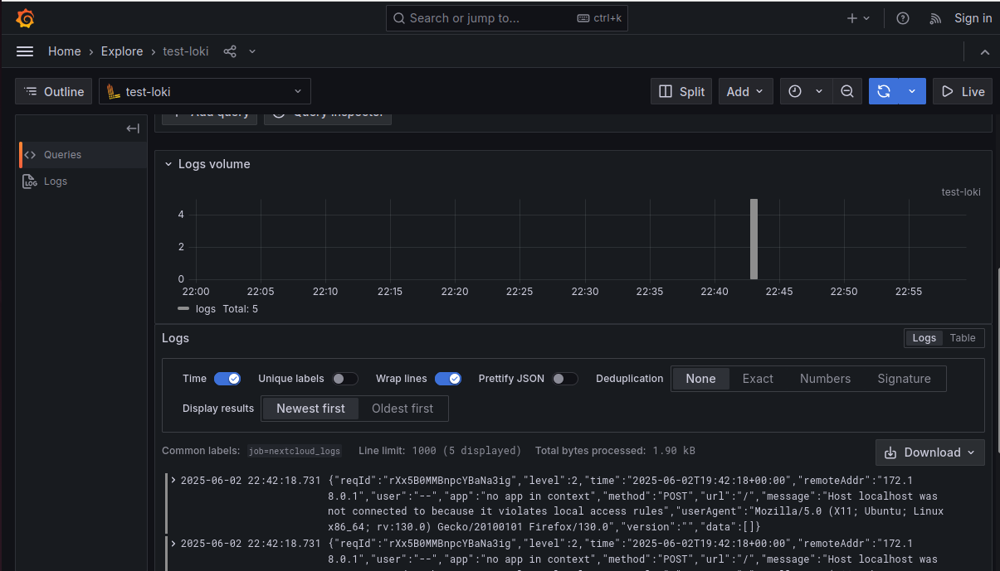

# Лабораторная работа №3. Loki + Zabbix + Grafana

## Цели работы:
Подключить к тестовому сервису Nextcloud мониторинг + логирование. Осуществить визуализацию через Grafana.

## Выполение работы:
### 1. Логирование
Создаём файл [docker-compose.yml](docker-compose.yml), который содержит в себе тестовые сервисы Nextcloud, Loki, Promtail, Grafana, Zabbix и Postgres для него.
</br>Так же создаём конфигурационный файл [promtail_config.yml](promtail_config.yml) для Promtail.
Стартуем docker-compose.yml командой `docker-compose up -d`, 
в результате должны увидеть, что все контейнеры с сервисами успешно создались и запустились (проверить можно командой 	`docker ps`):


Далее открываем в браузере Nextcloud по адресу localhost:8080, и регистрируем аккаунт:


Проверяем, что логи записываются в лог фаел, для этого выполним команды:

```
docker exec -it <ID контейнера с nextcloud> bash
cat data/nextcloud.log
```


Так же проверяем в логах promtail, что он "подцепил" нужный нам log-файл: должны быть строчки, содержащие **msg=Seeked/opt/nc_data/nextcloud.log**.
Для этого выполним команду `docker logs <ID контейнера с promtail>`


Видим желанные строки, всё хорошо.

### 2. Мониторинг
Переходим к настройке Zabbix. Подключаемся к веб-интерфейсу localhost:8082, и логинимся, используя логин **Admin** и пароль **zabbix**.


В разделе **Data collection → Templates** делаем **Import** кастомного шаблона (темплейта) для мониторинга nextcloud. Для импорта нужно предварительно
создать файл [template.yml](template.yml).


Чтобы Zabbix и Nextcloud могли общаться по своим коротким именам внутри докеровской сети, в некстклауде необходимо “разрешить” это имя. Для этого
нужно зайти на контейнер некстклауда под юзером **www-data** и выполнить команду `php occ config:system:set trusted_domains 1 --value="nextcloud"`:


Переходим в **Data collection -> Hosts**, жмём **Create host**. Указываем имя контейнера nextcloud, видимое имя - любое, хост группа - Applications.
В поле Templates выбираем добавленный ранее шаблон **Templates/Applications -> Test ping template**


Настройка хоста закончена. Переходим в раздел **Monitoring -> Latest data**. Через какое-то время там должны появиться первые данные, в
нашем случае значение healthy.


На этом мониторинг можно считать успешно настроенным. Для проверки включим в некстклауде **maintenance mode** командой `php occ maintenance:mode--on` в контейнере,
проверяем, что сработал триггер (в разделе **Monitoring → Problems**). Потом выключаем режим обратно `php occ maintenance:mode --off` и убеждаемся, что
проблема помечена как "решенная".


### 3. Визуализация
В терминале выполняем команду `docker exec -it grafana bash -c "grafana cli plugins install alexanderzobnin-zabbix-app"` , затем `docker restart grafana`


Заходим в графану localhost:3000, раздел **Administration -> Plugins**. Найти там **Zabbix** и активируем, нажав **Enable**.


Далее подключаем Loki к Grafana, раздел **Connections -> Data sources -> Loki**. В настройках подключения указываем имя loki и адрес http://loki:3100 , все
остальное можно оставить по дефолту:


Сохраняем подключение, нажав **Save & Test**. Если нет ошибок и сервис предлагает перейти к визуализации и/или просмотру данных, значит всё
настроено правильно


Далее можно перейти в **Explore**, выбрать в качестве селектора **job** либо **filename** — если все было правильно настроено, то нужные значения будут в выпадающем списке. Затем нажать **Run query** и увидеть свои логи.




### 4. Задание: создать дашборд
Пример дашборда с данными из логов nexcloud и loki в качестве источника данных. Были применены трансформации Extract fileds и Organize fields.


## Ответы на вопросы
Вопрос: В чем разница между мониторингом и observability?
</br>Ответ: мониторинг позволяет получать данные о состоянии отдельных компонентов системы, а observability позволяет увидеть всю систему целиком и понять, что, где и как произошло.
